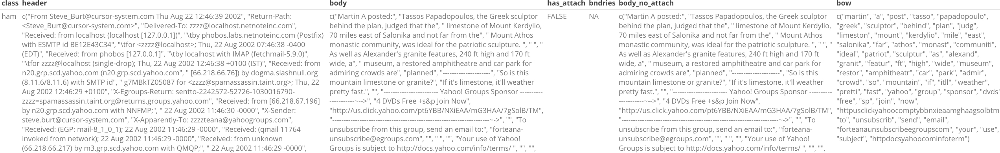
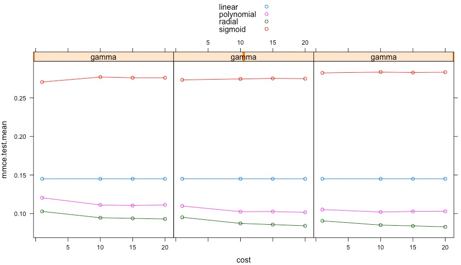

```{r include=FALSE}
library(tidyverse)
library(ggthemr)
library(mlr)
ggthemr("flat")
library(knitr)
library(kableExtra)
library("rpart") 
library("partykit")
options(knitr.table.format = "latex") 
knitr::opts_chunk$set(fig.pos = 'H')
knitr::opts_chunk$set(cache = TRUE,
                      message = FALSE,
                      warning = FALSE,
                      echo = FALSE)
```

```{r data-p-1, message=FALSE, warning=FALSE, include=FALSE}
easy_ham <- fs::dir_ls("large_data/messages/easy_ham/",recursive = T) %>% 
        purrr::map(~read_lines(.x))
easy_ham_2 <- fs::dir_ls("large_data/messages/easy_ham_2/",recursive = T) %>% 
        purrr::map(~read_lines(.x))
hard_ham <- fs::dir_ls("large_data/messages/hard_ham/",recursive = T) %>% 
        purrr::map(~read_lines(.x))
spam <- fs::dir_ls("large_data/messages/spam/",recursive = T) %>% 
        purrr::map(~read_lines(.x))
spam_2 <- fs::dir_ls("large_data/messages/spam_2/",recursive = T) %>% 
        purrr::map(~read_lines(.x))
```

```{r data-p-2, message=FALSE, warning=FALSE, include=FALSE}
split_msg <- function(x){
        split_point = match("", x)
        return(list(
                header = x[1:(split_point-1)],
                body = x[-(1:split_point)]))
}
has_attachment <- function(header){
        CTloc = grep("Content-Type", header)
        if(length(CTloc)==0) return(0)
        multi = grep("multi", tolower(header[CTloc]))
        if(length(multi)==0) return(0)
        multi
}
get_boundary <- function(header){
        boundary_idx = grep("boundary=",header)
        boundary=gsub('"',"",header[boundary_idx])
        gsub(".*boundary= *([^;]*)?.*","\\1",boundary)
}
drop_attachments = function(body, boundary){
  
  bString = paste("--", boundary, sep = "")
  bStringLocs = which(bString == body)
  
  if (length(bStringLocs) <= 1) return(body)
  
  eString = paste("--", boundary, "--", sep = "")
  eStringLoc = which(eString == body)
  if (length(eStringLoc) == 0) 
    return(body[ (bStringLocs[1] + 1) : (bStringLocs[2] - 1)])
  
  n = length(body)
  if (eStringLoc < n) 
     return( body[ c( (bStringLocs[1] + 1) : (bStringLocs[2] - 1), 
                    ( (eStringLoc + 1) : n )) ] )
  
  return( body[ (bStringLocs[1] + 1) : (bStringLocs[2] - 1) ])
}
get_bow <- function(x) {
        tibble(
                text = x %>%
                        enc2native() %>% 
                        tm::removePunctuation() %>%
                        tm::removeNumbers() %>%
                        tm::removeWords(words = tm::removePunctuation(tm::stopwords())) %>%
                        tm::removeWords(words = c("\\x")) %>% 
                        tm::stemDocument() %>%
                        tm::stripWhitespace()
                ) %>%
                tidytext::unnest_tokens(word, text) %>% 
                pull(word) %>% 
                unique()
}
get_log_odds_pred <- function(test_case){
        test_case <- test_case[test_case %in% train_bow]
        prob_calc_df %>% 
                dplyr::filter(bow %in% test_case) %>% 
                pull(log_odds_ratio) %>% 
                sum()
}
```

```{r data-p-3}
raw_df <- bind_rows(
        tibble(class = "ham", email = easy_ham),
        tibble(class = "ham", email = easy_ham_2),
        tibble(class = "ham", email = hard_ham),
        tibble(class = "spam", email = spam),
        tibble(class = "spam", email = spam_2)
        )
raw_df2 <- raw_df %>% 
        mutate(
                splits =map(raw_df$email, possibly(~split_msg(.x),otherwise = NA)),
                header=map(splits,possibly(~.x[1]$header,otherwise = NA)),
                body=map(splits,possibly(~.x[2]$body,otherwise = NA)),
                has_attach = map_dbl(header,~has_attachment(.x)) > 0,
                bndries = map(header,~get_boundary(.x)),
                bndries = map_chr(bndries, ~.x[1]),
                body_no_attach = map2(body, bndries, ~drop_attachments(.x, .y))
        ) %>% 
        select(-email,-splits)

train_index <- caret::createDataPartition(y = raw_df2$class, p = 0.7, list = F)

train_df = raw_df2[train_index,]
test_df = raw_df2[-train_index,]
 
train_df <- train_df %>% 
        mutate(bow = map(body_no_attach, possibly(~get_bow(.x),otherwise = NA))) %>%
        dplyr::filter(bow %>% map_lgl(~!is.logical(.x)))
test_df <- test_df %>% 
        mutate(bow = map(body_no_attach, possibly(~get_bow(.x),otherwise = NA))) %>%
        dplyr::filter(bow %>% map_lgl(~!is.logical(.x)))
```

# The Modeling Problem

The objective of this assignment is to develop classification models which can analyze emails and categorize them as spam or not.

# Data

The emails are provided as individual ascii files. There are a total of 9,362 files totaling roughly 114 MB on disk. The data in the files is not clean - neither is the data in a long or short dataframe format, nor is it formatted in a cleaned and consistent key-value dictionary pair format. The following shows the first 10 lines for one of the emails. We can see that these data are a mixture lines without key-value pair formatting (line 1), and some approximate key-value pair ":" separated formatting.

        From ilug-admin@linux.ie  Mon Sep  2 13:13:50 2002
        Return-Path: <ilug-admin@linux.ie>
        Delivered-To: zzzz@localhost.netnoteinc.com
        Received: from localhost (localhost [127.0.0.1])
        	by phobos.labs.netnoteinc.com (Postfix) with ESMTP id 6A0CD47C7C
        	for <zzzz@localhost>; Mon,  2 Sep 2002 07:43:01 -0400 (EDT)
        Received: from phobos [127.0.0.1]

Each file is marked `spam` or `ham`, the two classes to predict. The preparation of the data for modeling differed between the Naive Bayes approach - which requires a word frequency based approach for the two classes - and the classification algorithms like randomForest, Support Vector Machine, decision trees, and logistic regression - which require features to be extracted from the email corpus.

## Data Preparation

The data is processed entirely using a `tidyverse` approach using data preparation verbs from `dplyr`, `readr` and `tidyr`. Fundamentally, each file is stored "within" a dataframe as an object [this is using the *list-columns* feature of `tibbles`]. Thus, we start with a dataframe which is 9,362 rows by 2 columns [class and raw data]. For each data operation performed, a new column is added which appends a column holding the transformed data objects. To prepare the data for the NB model, the following steps are taken.

* All 9,362 files are read into a tibble. Each file is read in line by line, and stored as a  character vector of the length of each respective file.
* Each email is split into header and body sections
* For each email, we check if attachments are present
* If present, the body if the email is extracted sans-attachments
* The "dirty" header is then processed to a cleaned named-character vector which is used downstream in the latter modeling approaches
* The body of the emails are extracted into a bag of words after the following clean up activities:
    - conversion of text to UTF-8 encoding
    - removal of punctuation
    - removal of special characters
    - case conversion to lowercase
    - removal of numbers
    - removal of common stop words
    - removal of excess whitespaces
    - word stemming



A total of 7 functions in R achieve this initial cleanup. Thereafter, the list of bag of words is converted to a term-frequency matrix, which stores the number of emails containing each unique word grouped by the response variable. Table 1 shows a few lines from this matrix.

```{r}
nested_df <- train_df %>% tidyr::nest(-class)

training_bow <- nested_df$data[[1]] %>% pull(bow) %>% unlist() %>% tibble(bow = .) %>% count(bow) %>% mutate(class = "ham") %>% bind_rows(nested_df$data[[2]] %>% pull(bow) %>% unlist() %>% tibble(bow = .) %>% count(bow) %>% mutate(class = "spam"))

training_bow %>% arrange(-n) %>% group_by(class) %>% slice(1:2) %>% kable(booktabs = T, caption = "Word frequency count, by class") %>% kableExtra::kable_styling(latex_options = c("striped", "hold_position"))
```

## Data Dictionary

To prepare the data for the rest of the classification approaches, the following features are created:

* `isRE` : Does the subject line start with Re?
* `numLines` : How many lines are in the body, sans attachment?
* `perCapsSub` : Number of capital letters in the subject
* `perCapsBody` : Number of capital letters in the body
* `underscore` : Does the sender's email have an underscore in it?
* `subMarkCnts` : How many ? and ! are present in the body?
* `dlrCnt` : How many $ are present in the body?
* `numRecip`: How many people is the email sent to?
* `Priority` : What is the priority tag of the email?

Ten `tidyverse` functions are writting which allow the dataframes to be altered using pipes. This makes the data preparation steps easy to read, and replicable for both the training and the test datasets. The appendix shows a code sample for this. 

```{r  data-p-4}
processHeader = function(header)
{
  # modify the first line to create a key:value pair
  header[1] = sub("^From", "Top-From:", header[1])

  headerMat = read.dcf(textConnection(header), all = TRUE)
  headerVec = unlist(headerMat)

  dupKeys = sapply(headerMat, function(x) length(unlist(x)))
  names(headerVec) = rep(colnames(headerMat), dupKeys)
  
  return(headerVec)
}
processAttach = function(body, contentType){

  n = length(body)
  boundary = get_boundary(contentType)

  bString = paste("--", boundary, sep = "")
  bStringLocs = which(bString == body)
  eString = paste("--", boundary, "--", sep = "")
  eStringLoc = which(eString == body)

  if (length(eStringLoc) == 0) eStringLoc = n
  if (length(bStringLocs) <= 1) {
    attachLocs = NULL
    msgLastLine = n
    if (length(bStringLocs) == 0) bStringLocs = 0
  } else {
    attachLocs = c(bStringLocs[ -1 ],  eStringLoc)
    msgLastLine = bStringLocs[2] - 1
  }

  msg = body[ (bStringLocs[1] + 1) : msgLastLine]
  if ( eStringLoc < n )
    msg = c(msg, body[ (eStringLoc + 1) : n ])

  if ( !is.null(attachLocs) ) {
    attachLens = diff(attachLocs, lag = 1)
    attachTypes = mapply(function(begL, endL) {
      CTloc = grep("^[Cc]ontent-[Tt]ype", body[ (begL + 1) : (endL - 1)])
      if ( length(CTloc) == 0 ) {
        MIMEType = NA
      } else {
        CTval = body[ begL + CTloc[1] ]
        CTval = gsub('"', "", CTval )
        MIMEType = sub(" *[Cc]ontent-[Tt]ype: *([^;]*);?.*", "\\1", CTval)
      }
      return(MIMEType)
    }, attachLocs[-length(attachLocs)], attachLocs[-1])
  }

  if (is.null(attachLocs)) return(list(body = msg, attachDF = NULL) )
  return(list(body = msg,
             attachDF = data.frame(aLen = attachLens,
                                     aType = unlist(attachTypes),
                                     stringsAsFactors = FALSE)))
}
get_processedHeader <- function(df){
        df %>%
                mutate(header_processed = map(header,possibly(~processHeader(.x),otherwise = NA)))
}
get_contentTypes <- function(df){
        df %>%
                mutate(content_types = map_chr(header_processed, ~.x["Content-Type"]))
}
get_attachInfo <- function(df){
        df %>%
                mutate(attach_info = map2(.x = body,.y = content_types,.f = ~processAttach(.x, .y)[[2]]))
}
get_isRE <- function(df){
        df %>%
                mutate(isRe = map_lgl(header_processed,
                                      possibly(~(ifelse(nchar(.x["Subject"])==0,
                                               NA,
                                               length(grep("^[ ]*Re:", .x["Subject"]))>0)
                                        ), otherwise = NA)))
}
get_numLines <- function(df){
         df %>%
                mutate(numLines = map_int(body_no_attach, ~length(.x)))
}
get_perCapsSub <- function(df){
        subjects <- map(df$header_processed,~.x["Subject"]) %>%
                unlist() %>%
                tm::removePunctuation()
        subjects <- stringi::stri_encode(subjects)
        perCaps <- stringr::str_count(subjects, "[A-Z]") / stringr::str_length(subjects)
        perCaps[stringr::str_length(subjects)==0] <- 0
        df %>% mutate(perCapsSub = round(perCaps,3))
}
get_perCapsBody <- function(df){
        body_ <- map(df$body_no_attach,~paste(.x, collapse = " ")) %>% unlist()
        body_ <- tm::removePunctuation(body_)
        body_ <- stringi::stri_encode(body_)
        perCaps <- stringr::str_count(body_, "[A-Z]") / stringr::str_length(body_)
        df %>% mutate(perCapsBody = round(perCaps,3),
                      bodyCharCt = stringr::str_length(body_))
}
get_underscore <- function(df){
        emails <- map(df$header_processed,~.x["From"]) %>%
                unlist() %>%
                stringr::str_extract(pattern = "(?!\\<)[\\w\\d\\s\\.\\-\\@]*(?=\\>)")
        df %>% mutate(underscore = stringr::str_detect(emails, "_"))
}
get_subMarkCnts <- function(df){
        subjects <- map(df$header_processed,~.x["Subject"]) %>%
                unlist() %>%
                stringi::stri_encode()
        df %>% mutate(
                sub_exclMarkCnt = stringr::str_count(subjects, "!"),
                sub_quesMarkCnt = stringr::str_count(subjects, "\\?"))
}
get_dlrCnt <- function(df){
        body_ <- map(df$body_no_attach,~paste(.x, collapse = " ")) %>% unlist() %>% stringi::stri_encode()
        df %>% mutate(dlrCnt = stringr::str_count(body_,"\\$"))
}
get_numRecipPriority <- function(df){
        df %>% mutate(numRecip=map_int(header_processed,~(sum(names(.x)=="Delivered-To"))),
                      priority=map_chr(header_processed, ~(.x["X-Priority"]) %>% stringr::str_extract("\\d")),
                      priority=as.numeric(priority))
}
```

```{r data-p-5}
model_df = raw_df2[train_index,]
model_test_df = raw_df2[-train_index,]
model_df <- model_df %>%
        get_processedHeader() %>%
        get_contentTypes() %>%
        get_attachInfo() %>%
        get_isRE() %>%
        get_numLines() %>%
        get_perCapsSub() %>%
        get_perCapsBody() %>%
        get_underscore() %>%
        get_subMarkCnts() %>%
        get_dlrCnt() %>%
        get_numRecipPriority()
model_test_df <- model_test_df %>%
        get_processedHeader() %>%
        get_contentTypes() %>%
        get_attachInfo() %>%
        get_isRE() %>%
        get_numLines() %>%
        get_perCapsSub() %>%
        get_perCapsBody() %>%
        get_underscore() %>%
        get_subMarkCnts() %>%
        get_dlrCnt() %>%
        get_numRecipPriority()
```

```{r}
model_df %>% 
        dplyr::select(class,isRe,numLines,perCapsSub,perCapsBody,bodyCharCt,underscore,sub_exclMarkCnt,sub_quesMarkCnt,dlrCnt,numRecip,priority) %>% 
        sample_n(4) %>% 
        kable(digits = 2, caption = "Modeling dataframe with feature engineering variables", booktabs = T) %>%
        kableExtra::kable_styling(latex_options = c("striped", "hold_position","scale_down"))
```

\newpage

# EDA

Some basic univariate and bivariate exploration shows us some key predictors towards deciding if an email is spam or not. In the figure below, we can see that almost all messages marked priority 1, 2 or 5 are spam messages. Priority 3 (which is usually the default in most email service applications) is nearly an equal split between the two classes. The graph to the right shows the splits by `isRe` which measures if the subject starts with 'Re:'. Here, we can see that almost all email messages which do start with 'Re:' are not spam.

```{r out.width='70%', fig.height=4, fig.width=9, message=FALSE, warning=FALSE, fig.cap="Exploratory Data Analysis showing a few predictor variables which show markedly different distributions for ham vs spam", fig.align="center"}
model_df %>% 
        ggplot()+
        geom_bar(aes(priority, fill=class), position = "fill") + 
        theme(legend.position = "top")-> p1
model_df %>% 
        ggplot()+
        geom_bar(aes(isRe, fill=class), position = "fill") + 
        theme(legend.position = "top") -> p2

gridExtra::arrangeGrob(p1, p2, nrow = 1) %>% plot()
```

# Model Building

In total, 5 models are built:

1. Naive Bayes using a custom built code (following the directions in the chapter)
1. Decision Trees (using `rpart`)
1. Random Forests (using `randomForest`)
1. Logistic Regression (using `glm`)
1. Support Vector Machines (using `e1071`)

While investigating the models 2-5, the packages mentioned above are used. `caret` is used for some hyper-parameter tuning. Finally, to compare all the models together, the `mlr` package is used which offers the excellent `benchmark` functionality with associated plotting and model comparison tools. 


## Resampling & Validation Strategy

The model evaluation strategy of a 70-30 Holdout for train and testing is adopted for all the models. The splits are stratified on the response variable to keep the probability distributions consistant across the two sets. 

The resulting datasets are 6,055 and 2,616 long for training and testing respectively.

A 10-fold cross validation resampling strategy is used while hyper parameter tuning some of the machine learning models. This cross validation is performed on the 70% training split only.

## Model #1: Naive Bayes

For the naive bayes model, the objective is to count the relative frequencies of each word in the spam and ham emails. Based on these observed frequencies in the training dataset, a prior model is build. Then, for each email in the test dataset, the priors are used to calculate a log odds ratio. If the log odds ratio is less than a threshold (we start out with 0 as the threshold), then the email is classified as ham. If the ratio is positive, the email is classified as spam. 

This logic is applied to the dataset prepared for NB modeling. A sample dataframe is shown below.

```{r}
n_ham_messages <- sum(train_df$class=="ham")
n_spam_messages <- sum(train_df$class=="spam")

prob_calc_df <- training_bow %>% spread(class,n,fill=0) %>% #ham and spam columns are message counts with the words in bow
        mutate(
                ham_present_ratio = (ham + 0.5) / (n_ham_messages + 0.5),
                spam_present_ratio = (spam + 0.5) / (n_spam_messages + 0.5),
                ham_absent_ratio = (n_ham_messages - ham + 0.5) / (n_ham_messages + 0.5),
                spam_absent_ratio = (n_spam_messages - spam + 0.5) / (n_spam_messages + 0.5),
                log_ratio_present = log(spam_present_ratio) - log(ham_present_ratio),
                log_ratio_absent = log(spam_absent_ratio) - log(ham_absent_ratio)

        ) %>%
        # select(
        #         word = bow,
        #         log_ratio_present,
        #         log_ratio_absent
        # ) %>%
        mutate(log_odds_ratio = log_ratio_present +log_ratio_absent)

prob_calc_df %>%
        arrange(-ham) %>% 
        head(4) %>% 
        kable(digits = 2, booktabs = T, caption = "Naive Bayes dataframe showing calculations of the log odds ratio for each word in the training dataset") %>%
        kableExtra::kable_styling(latex_options = c("striped", "hold_position","scale_down"))
```

```{r}
train_bow <- prob_calc_df %>% pull(bow)
test_df <- test_df %>%
        mutate(log_odds_pred = map_dbl(test_df$bow, ~get_log_odds_pred(.x)),
               pred = ifelse(log_odds_pred<0,"ham","spam"))
```

Since this modeling approach uses priors calculated from the training dataset, this method only works for words which the model has already seen before. Thus, the method does require a large sample size of representative spam and ham data to be able to make good calls. In this exercise, there seems to be enough data, given that the test set performance is quite good. The mmce for the test set is `r round(mlr::measureMMCE(test_df$class,test_df$pred), 3)`, with the fpr and fnr at `r round(mlr::measureFPR(test_df$class, test_df$pred, positive = "spam", negative = "ham"), 3)` and `r round(mlr::measureFNR(test_df$class, test_df$pred, positive = "spam", negative = "ham"), 3)` respectively.

We can visualize the distributions of the ham and spam log odds ratio calculations as shown in the figure below. The clear separation of the two density distributes shows us that the model performs exceptionally well for being such a simple (or naive) approach towards classification.

```{r message=FALSE, warning=FALSE, out.width='60%', fig.align="center", fig.cap="Density plots showing the difference in the log odds ratio between the spam and ham messages for the NB model applied to the test dataset"}
test_df %>%
        ggplot()+
        geom_vline(xintercept = 0,color='forestgreen',lty=2)+
        geom_density(aes(x=log_odds_pred,fill=class), alpha = 0.5)+
        scale_x_continuous(limits = c(-400,400))
```

The threshold used to classify spam vs ham in the scenario above is 0. However, it is possible to trade off FPR for FNR by varying the threshold value. This is investigated and plotted below. By increasing the threshold, a larger number of emails are correctly classified as ham, at the risk of misclassifying correct emails as spam.

```{r message=FALSE, warning=FALSE, out.width='60%', fig.align="center", fig.cap="Change in FPR and FNR as the threshold for classifying spam message is varyied from -10 to 10. The dotted line at 2.75 shows where the two error rates are equal."}
get_fpr_error <- function(threshold){
        df <- test_df %>%
                mutate(pred = ifelse(log_odds_pred<threshold,"ham","spam"))
        mlr::measureFPR(truth = df$class, response = df$pred, negative = "ham", positive = "spam")
}
get_fnr_error <- function(threshold){
        df <- test_df %>%
                mutate(pred = ifelse(log_odds_pred<threshold,"ham","spam"))
        mlr::measureFNR(truth = df$class, response = df$pred, negative = "ham", positive = "spam")

}
get_mmce <- function(threshold){
        df <- test_df %>%
                mutate(pred = ifelse(log_odds_pred<threshold,"ham","spam"))
        mlr::measureMMCE(truth = df$class, response = df$pred)

}
fpr_errors <- seq(-10,10,by = 0.01) %>% purrr::map_dbl(~get_fpr_error(.x))
fnr_errors <- seq(-10,10,by = 0.01) %>% purrr::map_dbl(~get_fnr_error(.x))
mmce_errors <- seq(-10,10,by = 0.01) %>% purrr::map_dbl(~get_mmce(.x))
tibble(
        threshold = seq(-10,10, by = 0.01),
        FPR_Error = fpr_errors,
        FNR_Error = fnr_errors
        ) %>%
        gather(key = key, value = value, -threshold) %>%
        ggplot()+
        geom_line(aes(threshold,y=value,color=key),lwd=1)+
        geom_vline(xintercept = 2.75,lty=2)+
        theme(legend.position = "top")
```

## Model #2: Decision Tree

```{r  data-p-6}
keep <- c("class",
        "has_attach",
        "isRe",
        "numLines",
        "perCapsSub",
        "perCapsBody",
        "bodyCharCt",
        "underscore",
        "sub_exclMarkCnt",
        "sub_quesMarkCnt",
        "dlrCnt",
        "numRecip",
        "priority")

fit_df <- model_df[,keep]
model_test_df <- model_test_df[,keep]

fit_df$class <- factor(fit_df$class,
                         levels = c("spam","ham"),
                         labels = c("spam","ham"))
model_test_df$class <- factor(model_test_df$class,
                         levels = c("spam","ham"),
                         labels = c("spam","ham"))
```

A decision tree is built on the training data with tuning parameters `minimum split size` = 20, `minimum bucket size` = 50, `complexity` = 0.01. The performance of this model is modest - 89% accuracy, with a FPR of 0.8 and FNR of 0.91. Per the decision tree, the most important variables seem to be `perCapsBody`, `isRe` and `bodyCharCt`.

```{r message=FALSE, warning=FALSE, out.width='80%', fig.align="center", fig.cap="Decision tree build on the training dataset", fig.height=3.2}
rpFit <- rpart::rpart(formula = class~.,
               data = fit_df,
               control = rpart.control(minsplit = 20,
                                       minbucket = 50,
                                       cp = 0.01))
rpPred <- predict(rpFit, model_test_df[,-1])
rpPredClass <- rpPred[,"spam"]>0.5
rpPredClass <- factor(rpPredClass,
                         levels = c(T,F),
                         labels = c("spam","ham"))
#caret::confusionMatrix(rpPredClass, model_test_df$class)
library(rpart.plot)
rpart.plot(rpFit)
```

## Model #3: Random Forest

The random forest model has only one important hyperparameter to tune - mtry which is the number of random variables selected for each iteration. This is set to 5, using cross validation to minimize the test set misclassification error.

```{r}
rf_df <- fit_df %>%
        mutate(
                isRe = ifelse(is.na(isRe), F, isRe),
                perCapsSub = ifelse(is.na(perCapsSub), 0, perCapsSub),
                underscore = ifelse(is.na(underscore), F, underscore),
                sub_exclMarkCnt = ifelse(is.na(sub_exclMarkCnt),
                                         0, sub_exclMarkCnt),
                sub_quesMarkCnt = ifelse(is.na(sub_quesMarkCnt),
                                         0, sub_quesMarkCnt),
                priority = ifelse(is.na(priority), 0, priority)
        ) %>% .[,-1] %>%
        map_df(~as.numeric(.x)) %>%
        cbind(class=fit_df$class,.)

rf_test_df <- model_test_df %>%
        mutate(
                isRe = ifelse(is.na(isRe), F, isRe),
                perCapsSub = ifelse(is.na(perCapsSub), 0, perCapsSub),
                underscore = ifelse(is.na(underscore), F, underscore),
                sub_exclMarkCnt = ifelse(is.na(sub_exclMarkCnt),
                                         0, sub_exclMarkCnt),
                sub_quesMarkCnt = ifelse(is.na(sub_quesMarkCnt),
                                         0, sub_quesMarkCnt),
                priority = ifelse(is.na(priority), 0, priority)
        ) %>% .[,-1] %>%
        map_df(~as.numeric(.x)) %>%
        cbind(class=model_test_df$class,.)
```

```{r message=FALSE, warning=FALSE, out.width='60%', fig.align="center", fig.cap="Hyperparameter tuning for `mtry` for random forest using 5 fold cross validation", fig.height=3.2, fig.width=7}
library(randomForest)
tsk <- makeClassifTask(data = rf_df,
                       target = "class",
                       positive = "spam")
lrns <- makeLearner(id = "rf",
                   cl = "classif.randomForest",
                   predict.type = "prob")
rdesc = makeResampleDesc(method = "CV",
                         iters = 5,
                         stratify = TRUE)
meas <- list(mmce, fpr, fnr)
ps = makeParamSet(
  makeDiscreteParam("mtry", values = c(3,5,8,10))
)
ctrl <- makeTuneControlGrid()
res <- tuneParams(lrns,tsk,rdesc,meas,ps,ctrl)

getTuneResultOptPath(res) %>% ggplot(aes(as.numeric(as.character(mtry)),mmce.test.mean)) + geom_line() + geom_point() + scale_x_continuous(breaks = c(3,5,8,10)) + labs(x="mtry")
```

The model performance is very good. Misclassification error rate for spam messages is 11% while that for ham messages is 1.7%, with an overall error rate of 4.3%. 200 trees are adequate for the errors to stablise. The variable importance plot shows similar variables to the decision tree. 

```{r message=FALSE, warning=FALSE, out.width='60%', fig.align="center", fig.cap="Variable importance plots for random forest model", fig.height=6}
rfFit <- randomForest(x = rf_df[,-1],
                      y = rf_df$class,
                      ntree = 200,
                      mtry = 5,
                      xtest = rf_test_df[,-1],
                      ytest = rf_test_df$class,
                      replace = T,
                      importance = T)
varImpPlot(rfFit)
```

## Model #4: Logistic Regression

For this approach, a lasso logistic regression model is fit to the data. Lasso regression offers the advantage of inherent variable selection as coefficient estimates are allowed to go to zero. The only tuning parameter `lambda` which is set at 0.044 after running a 10 fold cross validation and using the 1-SE rule to decide the value. The graph below shows the results of the cross validation.

```{r message=FALSE, warning=FALSE, out.width='60%', fig.align="center", fig.cap="10 fold cross validation result of search for optimal value of `lambda` for lasso logistic regression model", fig.height=3.5}
library(glmnet)
cv.glmnet(x = as.matrix(rf_df[,-1]),
          y = (as.numeric(rf_df$class)-1),
          type.measure = "mse") %>% plot()
lassoFit <- glmnet(x = as.matrix(rf_df[,-1]),
          y = (as.numeric(rf_df$class)-1),
          alpha = 1,
          lambda = 0.04392322)
# lassoPred <- predict(lassoFit, newx = as.matrix(rf_test_df[,-1]))
# lassoClass <- factor(lassoPred>0.5, levels = c(F,T), labels = c("spam","ham"))
```

The resulting lasso model eliminates 5 of the 12 variables. The model itself is of mediocre performance, with a misclassificiation error rate of 0.188. While it is possible to improve this model by introducing interaction terms, this was not investigated further.

```{r}
coef(lassoFit) %>% as.matrix() %>% as.data.frame() %>% rownames_to_column("variable") %>% rename(beta_estimate=s0) %>% mutate(beta_estimate=as.character(round(beta_estimate,3)),beta_estimate=ifelse(beta_estimate=="0","-",beta_estimate)) %>% kable(caption = "Beta estimates for lasso model", booktabs=T) 
```


## Model #5: Support Vector Machine

The final model is a support vector machine classifier, in particular a kernel SVM classifier. There are a variety of kernels avaialble: linear, polynomial, radial, sigmoid, and for each kernel, there is a bandwidth and cost parameter which can be tuned. The choice of the hyper parameters is selected via 10 fold stratified cross validation based grid search across:

* `cost` : 1, 10, 15 or 20
* `gamma` : 0.1, 0.3 or 0.5
* `kernel` : linear, polynomial, radial or sigmoid

A total of 480 models are fit (made simpler to define, execute and manage via the `tuneParams` function in `mlr`). The best model was found to be for combination `cost` = 20, `gamma` = 0.5, and `kernel` = radial. 



The performance of this model is decent, with a misclassification error rate of 6.8%, with a FPR of 2% and FNR of 20%.

```{r}
# library(mlr)
# 
# svm_df <- rf_df
# svm_test_df <- rf_test_df
# 
# tsk <- makeClassifTask(data = svm_df,
#                        target = "class",
#                        positive = "spam")
# lrn <- makeLearner(cl = "classif.svm",predict.type = "response",
#                    par.vals = list(
#                            kernel = "polynomial",
#                            cost = 10,
#                            gamma = 0.3
#                    ))
# # rdesc = makeResampleDesc("CV", iters = 10, stratify = TRUE)
# # ps <- makeParamSet(
# #         makeDiscreteParam("cost", values = c(1,10,15,20)),
# #         makeDiscreteParam("gamma", values = c(0.1,0.3,0.5)),
# #         makeDiscreteParam("kernel", values = c("linear","polynomial","radial","sigmoid"))
# # )
# # ctrl <- makeTuneControlGrid()
# # res <- tuneParams(lrn, tsk, rdesc, par.set = ps, control = ctrl)
# # res$opt.path$env$path %>% mutate(cost=as.numeric(cost),gamma=as.numeric(gamma)) %>% lattice::xyplot(mmce.test.mean~cost|gamma,groups=kernel,.,auto.key = T, type = "b")
# 
# lrn = setHyperPars(lrn, par.vals = res$x)
# svmFit <- train(lrn,tsk)
# 
# # resampled_svm <- resample(learner = lrn, task = tsk, resampling = rdesc)
# 
# svmPreds <- predict(svmFit, newdata = svm_test_df)
# performance(svmPreds, measures = list(mmce, fpr, fnr,kappa ))
# mlr::calculateConfusionMatrix(svmPreds,relative = T)
```

# Model Comparison

## Measures

To compare the models against each other, three measures are considered:

1. `mmce` : Mean misclassification error, defined as: mean(response != truth)
1. `fpr` : False positive rate, defined as percentage of misclassified observations in the positive class. Also called false alarm rate or fall-out.
1. `fnr` : False negative rate, defined as percentage of misclassified observations in the negative class.

The results discussed in the model comparison below are all for the *test* portion of the hold-out resampling strategy. Finally, the models are also compared by plotting their performance on the Reciever Operating Curve (ROC) and calculating their Area Under the Curve (AUC) values.

```{r}
bmr_df <- rf_df %>% bind_rows(rf_test_df)

tsk <- makeClassifTask(data = bmr_df,
                       target = "class",
                       positive = "spam")
lrns <- list(
       makeLearner(id = "svm",
                   cl = "classif.svm",predict.type = "prob",
                   kernel = "polynomial",
                   cost = 20, gamma = 0.5),
       makeLearner(id = "lasso",
                   cl = "classif.glmnet",predict.type = "prob",
                   alpha = 1, lambda = 0.04392322),
       makeLearner(id = "rpart",
                   cl = "classif.rpart", predict.type = "prob",
                   minsplit = 20, minbucket = 50, cp = 0.01),
       makeLearner(id = "rf",
                   cl = "classif.randomForest",
                   predict.type = "prob",
                   mtry = 5)
)
rdesc = makeResampleDesc(method = "Holdout",
                         split = 0.7,
                         stratify = TRUE)
meas <- list(mmce, fpr, fnr)
bmr = benchmark(lrns, tsk, rdesc, meas)
```

The point estimates for the test set performance are shown in the figure below. There is a large range of performance across the models. The plot shows the FPR vs the FNR. The sizes of the text are given by the misclassification rates. We can see that the NB model, even though the simplest of them all, out performs the remaining models across all three performance measures. Random forest model comes in a close second place. 

```{r message=FALSE, warning=FALSE, out.width='50%', fig.align="center", fig.cap="Point estimates of test set performance measures for all 5 models", fig.height=4}
perf = getBMRPerformances(bmr, as.df = TRUE)
df = reshape2::melt(perf, id.vars = c("task.id", "learner.id", "iter"))
df = df %>%  bind_rows(data.frame(task.id="bmr_df", learner.id="nb", iter=1, variable="mmce", value = 0.0142)) %>% 
        bind_rows(data.frame(task.id="bmr_df", learner.id="nb", iter=1, variable="fpr", value = 0.0164)) %>% 
        bind_rows(data.frame(task.id="bmr_df", learner.id="nb", iter=1, variable="fnr", value = 0.00759))
df %>% dplyr::select(learner.id,variable,value) %>% spread(key = "variable", value = "value") %>% ggplot() + geom_text(aes(fnr,fpr,label=learner.id,size=mmce),check_overlap = T)+scale_size_continuous(range = c(3,5))+theme(aspect.ratio = 1)
```

The following chart shows the ROC curves for 4 of the 5 models. The ROC curve for the NB model wasn't able to be generated since the NB code was a custom code, as compared to the remaining models which use the `mlr` package's integrated interface. This chart confirms that the random forest model is the best performing, with an AUC of 0.98. SVM, rpart, and lasso models follow, with AUC values of 0.92, 0.91 and 0.89 respectively.

```{r message=FALSE, warning=FALSE, out.width='65%', fig.align="center", fig.cap="ROC curves for 4 of the models", fig.height=4}
df_thres <- generateThreshVsPerfData(
        list(
                rf    = getBMRPredictions(bmr, drop = T, learner.ids = "rf"),
                svm   = getBMRPredictions(bmr, drop = T, learner.ids = "svm"),
                rpart = getBMRPredictions(bmr, drop = T, learner.ids = "rpart"),
                lasso = getBMRPredictions(bmr, drop = T, learner.ids = "lasso")),
        measures = list(fpr, tpr))
plotROCCurves(df_thres)
```

The machine learning models using the engineered features could be improved by more feature engineering by exploiting data in the header and attachments. Some feature transformations like Weight Of Evidence could also add predictability for multi-level predictors.

\newpage

# Appendix

### Piping of the data processing steps

    > train_df %>%
    >    get_processedHeader() %>%
    >    get_contentTypes() %>%
    >    get_attachInfo() %>%
    >    get_isRE() %>%
    >    get_numLines() %>%
    >    get_perCapsSub() %>%
    >    get_perCapsBody() %>%
    >    get_underscore() %>%
    >    get_subMarkCnts() %>%
    >    get_dlrCnt() %>%
    >    get_numRecipPriority()

### Code Base

The code base is stored in github at this [link](https://github.com/rsangole/454_Assignments/tree/master/Assignment%204)