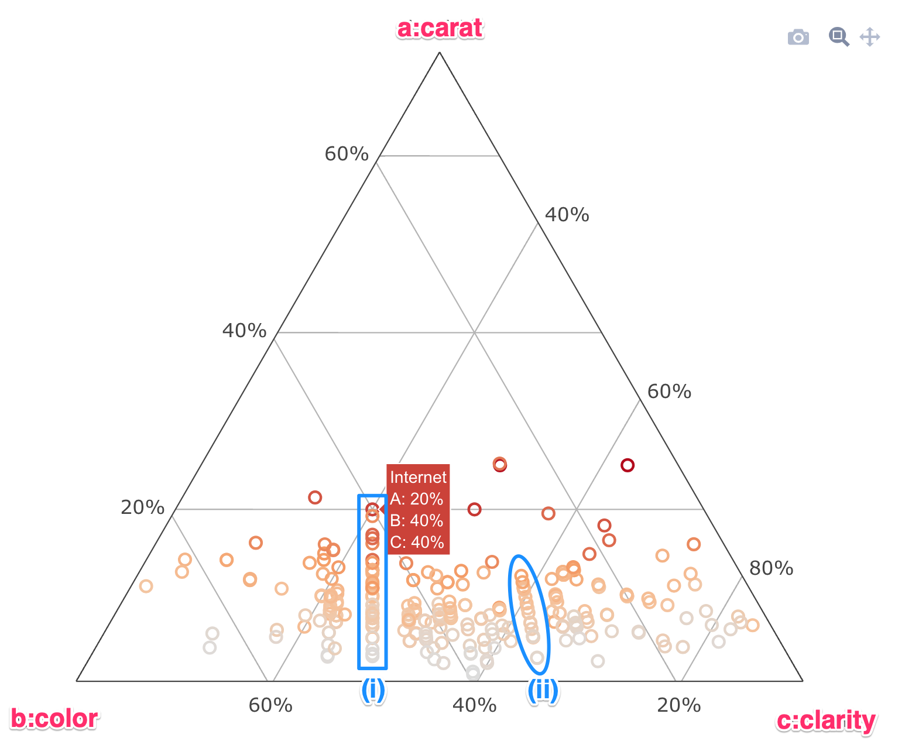
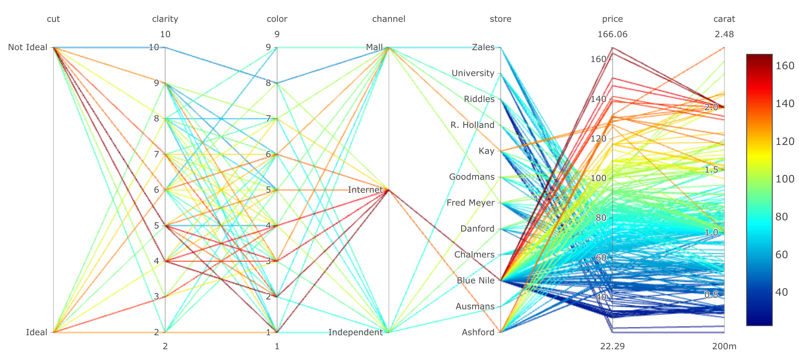
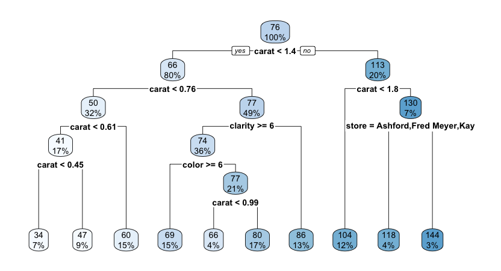
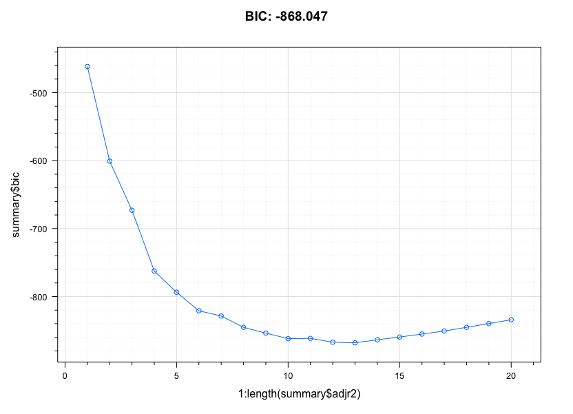
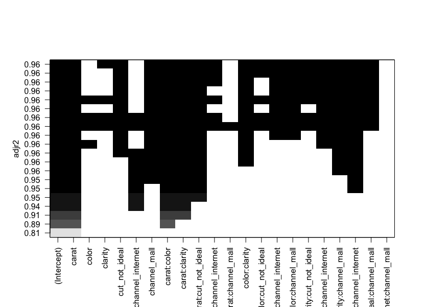
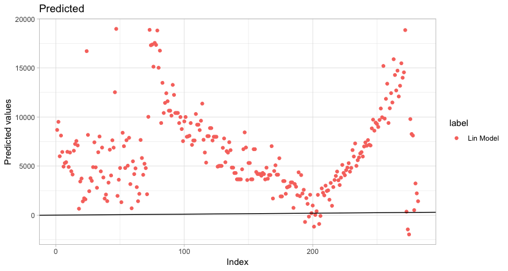

```{r load_packages, include = FALSE}
library("papaja")
library('tidyverse')
library('knitr')
library('kableExtra')
library('lattice')
library('latticeExtra')
options(knitr.table.format = "latex")
variables <- dir(path = '../cache', full.names = T, pattern = '.RData')
purrr::walk(variables, ~load(.x))
```

# Overview of Methodology

The approach used for this assignment, modeling the "Two month's Salary" dataset is as follows:

1. Data are split into train and test datasets before further consumption
1. Exploratory Data Analysis (EDA) was conducted at a univariate, bivariate and multivariate level using numerical and graphical summarizations
1. The EDA influenced the data preparation stage in terms of transforming the response variable, and adding new features to the predictor matrix
1. Models are built on two sets of data preparation: (i) with no interaction terms, and (ii) with interaction terms. The types of models investigated are linear regressions, variable selection procedures on regression (best subsets, forward & backward selection, lasso & ridge), tree models (recursive partition trees & conditional inference trees) and random forest models
1. Two staged of model building are conducted. In the first stage, models are built using individual R commands using each model's respective package (for example, `lm`, `regsubsets`, `party` and `partyKit` etc). This allowed a deep dive into the residuals and diagnostics for each model, which influenced the modeling strategy. Once the strategy is finalized, the `caret` package is used to build all models again using the `caret::train` interface. `caret::trainControl` is used to perform 10-fold cross validation to perform hyperparameter tuning and to determine the variation of performance for each model.
1. RMSE, MAE and RSquared are the metrics used to judge the performance of each model.
1. Once all the models are built using `caret`, each model is applied to the test dataset.
1. Model performance is compared on both the training and testing data, which reveals which model has generalized the best.

# Exploratory Data Analysis












# Data Preparation

```{r}
set.seed(11)
#kable(caption='Sample Items', booktabs = T) %>% kable_styling(latex_options = c('scale_down','HOLD_position'))
```

# Modeling

# Comparison

# Challenges and learnings

\newpage

# R Packages Used

\newpage

\begingroup
\setlength{\parindent}{-0.5in}
\setlength{\leftskip}{0.5in}

<div id = "refs"></div>
\endgroup