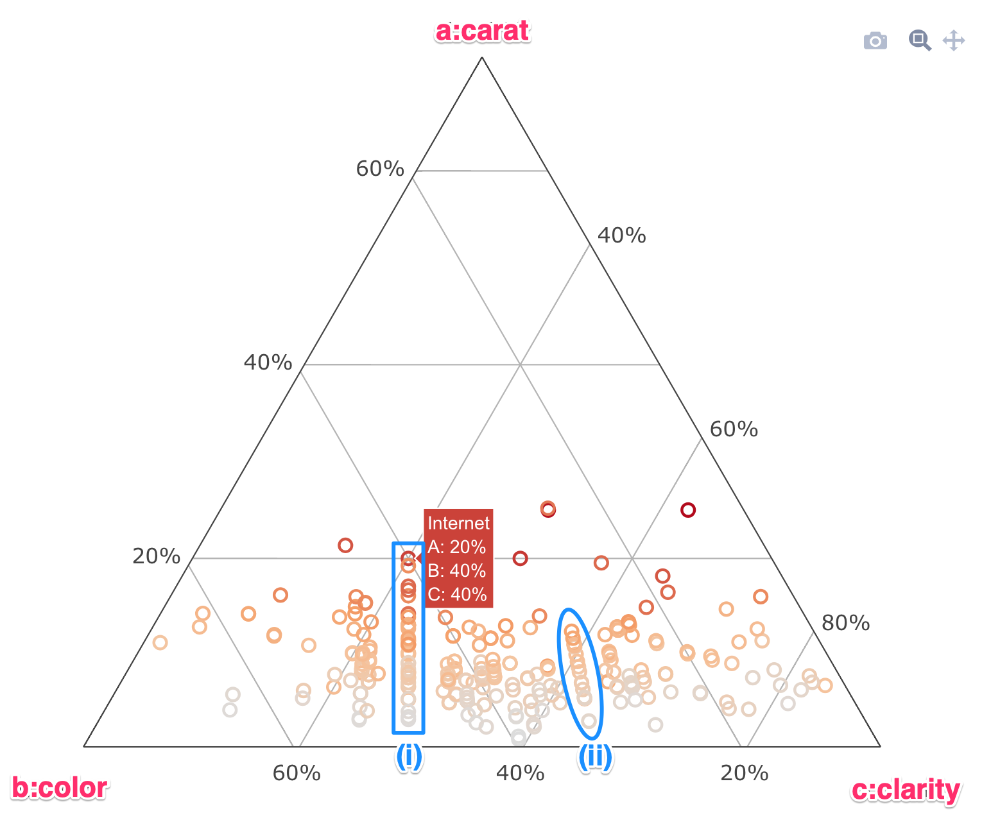
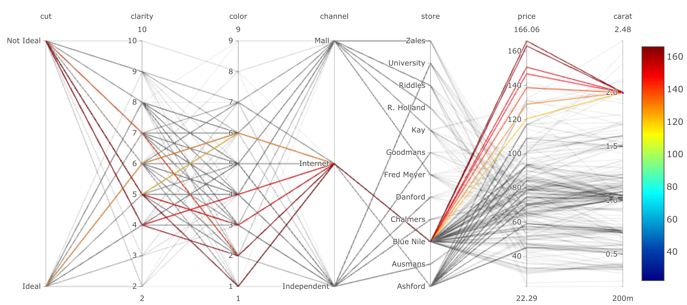

```{r setup, include=FALSE}
library(tint)
# invalidate cache when the package version changes
#knitr::opts_chunk$set(tidy = FALSE, cache.extra = packageVersion('tint'))
options(htmltools.dir.version = FALSE)
library("papaja")
library('tidyverse')
library('knitr')
library('kableExtra')
library('png')
library('grid')
options(knitr.table.format = "latex")
```


```{r loadvars, include=FALSE}
library('tidyverse')
library('lattice')
library('leaps')
library('elasticnet')
library('latticeExtra')
variables <- dir(path = '../cache', full.names = T, pattern = '.RData')
purrr::walk(variables, ~load(.x,envir = .GlobalEnv))
```

# Overview of Methodology

The approach used for this assignment, modeling the "Two month's Salary" dataset is as follows:

1. Data are split into train and test datasets before further consumption.
1. Exploratory Data Analysis (EDA) was conducted at a univariate, bivariate and multivariate level using numerical and graphical summarizations.
1. The EDA influenced the data preparation stage in terms of transforming the response variable, and adding new features to the predictor matrix.
1. Models are built on two sets of data preparation: (i) with no interaction terms, and (ii) with interaction terms. The types of models investigated are linear regressions, variable selection procedures on regression (best subsets, forward & backward selection, lasso & ridge), tree models (recursive partition trees & conditional inference trees) and random forest models.
1. Two staged of model building are conducted. In the first stage, models are built using individual R commands using each model's respective package (for example, `lm`, `regsubsets`, `party` and `partyKit` etc). This allowed a deep dive into the residuals and diagnostics for each model, which influenced the modeling strategy. Once the strategy is finalized, the `caret` package is used to build all models again using the `caret::train` interface. `caret::trainControl` is used to perform 10-fold cross validation to perform hyperparameter tuning and to determine the variation of performance for each model.
1. RMSE, MAE and RSquared are the metrics used to judge the performance of each model.
1. Once all the models are built using `caret`, each model is applied to the test dataset.
1. Model performance is compared on both the training and testing data, which reveals which model has generalized the best.

# Exploratory Data Analysis

Univariate and multivariate EDA is performed on the data. Two of the more interesting plots are presented here. The first plot is a ternary plot showing the relationship between 4 variables, `price`, `cut`, `carat` and `clarity`. `Price` is plotted as a color. Right away, we can see that `price` increases with `carat`, but seems independent of `color` and `clarity`. Secondly, there are two curious structures in the data. At (i) and (ii), there seem to be unusually linear relationships in the data, which could indicate some imputation or data entry process during the data gathering process.



Another very useful method for data exploration is utilizing interactive parallel plots using `plotly`. Several key insights are obtained. For example, the plot below, `carat` values _exactly_ equal to 2.0 are selected. We can see that all these data points are from the Blue Nile store only. Also, though `carat` and `price` are linearly related, oddly this relationship breaks down for `price` values above $20,000.



The false color level plot attached in the appendix also shows that there are very few stores which sell diamonds at a very high price point. This could be useful to improve model performance.

# Data Preparation

The original data are split into a `train` and `test` split using a stratified 70:30 split. The stratification is performed on the `price` response variable, to ensure that the resulting distributions are similar in nature, as shown to the right. The splitting is carried out using `caret::createDataPartition()`.

```{r traintestsplit, fig.margin=TRUE, fig.width=4, fig.height=4, cache=TRUE, echo=FALSE, fig.cap='Density plots for the Train-Test split'}
t1 <- df_train[,'price']
t1$set <- 'train'
t2 <- df_test[,'price']
t2$set <- 'test'
t1 %>% bind_rows(t2) %>% lattice::densityplot(~price,groups=set,.,auto.key=T) 
```

The response variable is quite right skewed with a small number of observations (81) beyond the 80th percentile. This combined with residual analysis for the initial linear regression models showed the need to transform the response. Box-cox analysis is conducted which recommends a `lambda` value of 0.2. This is applied to `price` which makes the variable a lot more normally distributed, as shown the figure to the right. 

```{r ytransform, fig.margin=TRUE, fig.width=4, fig.height=4, cache=TRUE, echo=FALSE, fig.cap='QQ plot showing the improvement of normality upon box-cox transformation of the pricing variable'}
t1 <- df_train[,'price']
t1$set <- 'price'
t2 <- df_train[,'price']
t2$price <- sqrt(t2$price)
t2$set <- 'price_boxcox'
t2 %>% bind_rows(t1) %>% qqmath(~price|set,.,scales = list(x = "free", y = "free"), layout=c(1,2))
```

Two additional feature variables are created: (i) Binary variable indicating if `carat` is exactly equal to 2.0, and (ii) Binary variable indicating if `carat` is greater than 2.0. Model-matrix dataframes are created using `model.matrix()` to convert the factor variables into 0/1 indicator variables. Second-order interaction terms are then included for all possible combinations and stored separately. Thus, there are two training dataframe available: No interactions (282, 19), and 2nd-order interactions (282, 134). While modeling, partial 2nd-order interactions are dynamically tested using the formula interface as well.

# Modeling

The overview of the modeling approach is as follows:

1. Linear regression models
    1. Simple multilinear regression
    1. Variable selection procedures: 
        . Best subsets regression
        . Forward selection
        . Backward selection
    1. Shrinkage methods:
        . Lasso
        . Ridge
1. Tree models:
    . Recursive partition trees 
    . Conditional inference trees
1. Random forest models

Details of each model are summarized below.

## Linear models

Linear regression models using `lm()` are fit on the data with and without the predictor transformation. Both models are statistically significant with RSquared values of 0.92 and 0.93 respectively. There are two `store` levels which do not have a fit estimate because of a linear combination which exists after dummy variable creation. This is addressed later in the modeling. The raw price linear model's residuals show a pattern which does get rectified upon box-cox transformation of the price variable. The appendix shows the summary of the linear model which shows all the major variables are statistically significant (except a few stores_ indicator variables), including the two new feature variables.

```{r lmres, fig.margin=TRUE, fig.show='hold', fig.width=4, fig.height=4, cache=TRUE, echo=FALSE, fig.cap='Summary of lm on raw price value'}
xyplot(fit_lm$finalModel$residuals~fit_lm$finalModel$fitted.values, lattice.options = ggplot2like.opts(),xlab='Fitted',ylab='Residuals',panel = function(...){panel.abline(h = 0,col = 'gray');panel.xyplot(...,type = c('smooth','p'),col.line = 'red',lwd = 1)})
```

## Variable selection using `bsr`

Various methods of variable selection are run on both the styles of the dataset, including backward and forward using the `leaps` package, and best subsets using `regsubsets`. For the backwards selection on the data without interaction terms, the variables selected are shown below. This model results in an RSquared value of 0.90, slightly lower than the linear model. The best RMSE for backwards selection is 0.239, with an MAE of 0.182.

```{r bwd_r2, fig.margin=FALSE, fig.show='hold', fig.width=8, fig.height=4, cache=TRUE, echo=FALSE, fig.cap = 'Variable selection using RSquared, backward selection'}
fit_bwd$finalModel %>% plot(scale='r2')
```

Forward selection gives a better RSquared than backward, given it includes a higher number of predictor variables. The best RMSE for forwards selection is 0.205, with an MAE of 0.167, which is much better than the backwards selection model.

```{r fwd_r2, fig.margin=FALSE, fig.show='hold', fig.width=8, fig.height=4, cache=TRUE, echo=FALSE, fig.cap = 'Variable selection using RSquared, forward selection'}
fit_fwd$finalModel %>% plot(scale='r2')
```

## Shrinkage models

```{r ridge, fig.margin=TRUE, fig.show='hold', fig.width=4, fig.height=4, cache=TRUE, echo=FALSE, fig.cap = 'Ridge regression trace plot'}
fit_ridge$finalModel %>% plot()
```

For lasso and ridge models, the dataset with interactions is used, since for the dataset without interactions, upon cross validation, no terms were eliminated for the dataset without interactions. The plot below shows the tranceplot for the variation in coefficients as the strength of regularization is changed for the ridge regression model. As expected `carat` has the strongest coefficient and is retained the longest, given it's strong correlation with the predictor. A large percentage of the remaining 100s of variables turn near zero. Cross validation is used to decide the hyperparameter.

```{r ridgecv, fig.margin=FALSE, fig.show='hold', fig.width=6, fig.height=3.5, cache=TRUE, echo=FALSE, fig.cap = 'Cross validation to fine tune the ridge regression parameter'}
fit_ridge %>% plot()
```

## Tree models

Two models are investigated in this section: a decision tree using `rpart`, and a conditional inference tree using `ctree`. For the `rpart` model, the decision tree obtained is shown here. As expected, `carat` is the dominant predictor, followed by `color` and `store`. The conditional trees are much more difficult to visually depict, though they performed much better than a simpler decision tree, as expected, since the simpler trees tend to have low bias and very high variance.

```{r tree, echo=FALSE, fig.cap=, fig.fullwidth=TRUE, fig.height=4, fig.show='hold', fig.width=8, message=FALSE, warning=FALSE, cache=TRUE}
library(rpart)
library(rpart.plot)
load('../cache/fit_rpart_1.RData',envir = .GlobalEnv)
fit_rpart_1 %>% rpart.plot()
```

## Random Forest models

RF models are built using `caret` and the `randomForest` package. Although both datasets are used for RF models, the dataset with explicit interactions performed much worse. Hyperparameters were tuned via 10 fold cross validation. `mtry` which selects how many variables to randomly pick at each split was selected to be 16 (out of 19), while the number of random trees built in each model stablizes after ~150 trees. The CV search result is shown here which shows 16 parameters.

```{r message=FALSE, warning=FALSE, fig.margin=FALSE, fig.show='hold', fig.width=6, fig.height=3.5, cache=TRUE, echo=FALSE, fig.cap = 'Cross validation to fine tune the ridge regression parameter'}
plot(fit_rf)
```

# Comparison

In total, 10 models are built, each with 10-fold cross validation performed on the training dataset, for a total of 100 individual models. `caret` package is used to build these models and also post process them. This processing is described below.

## Training set performance

The advantage of running all the models using `caret` is that this package allows the user to easily compare the performance of all the models using various procedures. For example, the plot below shows the comparison of the two metrics MAE and RMSE for each model, for each of the 10 validation sets in a 10-fold cross validation. This is still on the training dataset, but _should_ be indicative of performance on the test dataset.  MAE and RMSE show very similar performance for roughly all the models, except the Random Forest models which show a higher RMSE than linear regression, vs RF models show a lower MAE than linear regression. Since MAE is less sensitive to outliers, the high RMSE is probably driven by some of the outliers identified earlier. The dotplot shows the point estimates and 95% error bars for the RSquared values. Here, Lasso and Backward selection models with 2nd order interactions score the highest.

```{r resamps, fig.margin=TRUE, fig.show='hold', fig.width=4, fig.height=4, cache=TRUE, echo=FALSE, fig.cap='Comparison of the model performance for each of the 10 resamples in the 10-fold CV'}
load('../cache/resamps_plot_1.RData')
load('../cache/resamps_plot_3.RData')
plot(resamps_plot_1)
plot(resamps_plot_3)
```

## Test set performance

The table below compares the performance of the models when applied on the test set, which so far has remained untouched throughout the modeling process. Now, we can see that the RF model is stored at the very top, though only by a very slim margin. Lasso and Ridge are in the lead as well, while linear regression (lowest training RMSE model) is now at position 6.

```{r results_df, echo=FALSE, fig.cap='Test set performance, top 6 models by RSquared', message=FALSE, warning=FALSE, fig.height='70%'}
results_df %>% 
    dplyr::select(modelNames, R2_test, RMSE_test, MAE_test) %>% 
    arrange(-R2_test) %>% 
    slice(1:6) %>% 
    kable(caption='Results Compared', booktabs=T, digits=c(4,4,4)) %>% 
    kable_styling(latex_options = c('scale_down'))
```

We can compare the relative performance of the models on point estimates of all three metrics for the training and testing runs. This will allow us to understand how much each model has tended to overfit to the training data. As expected, in all cases, test set performance is worse than the training set. In terms of the least gap between the training and test set performance, the Lasso model with 2nd order interaction has done the best. in terms of the absolute best predictive performance, the RF model (without explicit interaction terms included) has performed the best.

```{r finalcomparison, fig.fullwidth=TRUE, fig.width=10, fig.height=4, cache=TRUE, echo=FALSE, fig.cap='Comparison of the final models on train and test datasets'}
p1 <- results_df %>%
    arrange(RMSE_test) %>%
    mutate(modelNames = factor(modelNames,levels = modelNames)) %>%
    dotplot(modelNames~RMSE_train+RMSE_test,.,auto.key=T, type='b', xlab='RMSE')
p2 <- results_df %>%
    arrange(MAE_test) %>%
    mutate(modelNames = factor(modelNames,levels = modelNames)) %>%
    dotplot(modelNames~MAE_train+MAE_test,.,auto.key=T, type='b',xlab='MAE')
p3 <- results_df %>%
    arrange(-R2_test) %>%
    mutate(modelNames = factor(modelNames,levels = modelNames)) %>%
    dotplot(modelNames~R2_train+R2_test,.,auto.key=T, type='b',xlab='R Sq')
gridExtra::grid.arrange(p1,p2,p3,ncol=3)
```

The scatter plot of the price prediction against the actual for both the datasets are shown here, which shows quite a strong perdictive performance. The model tends to deviate from truth at the extreme ends of the price spectrum, with stronger performance in the mid-section of price, where there are maximum number of points.

```{r y_yhat, fig.margin = TRUE, fig.width=4, fig.height=4, cache=TRUE, echo=FALSE, fig.cap='RanForest performance, gray: train data, blue: test data'}
xyplot(pred_test_rf~test_y_sqrt, xlab='Price', ylab='RF Price Prediction', lattice.options = ggplot2like.opts(),
panel = function(...){panel.abline(c(0,1),col.line = 'red',lty=2);panel.xyplot(y=pred_train_rf,x=train_y_sqrt,col='gray',pch=3);panel.xyplot(...)})
```

Since the objective of this assignment is purely predictive in nature, I would select the Random Forest model (with no explicit interactions).

\newpage

# Appendix

### Level plot
```{r lvlplot, fig.fullwidth=TRUE, fig.width=8, fig.height=4, cache=TRUE, echo=FALSE, fig.cap='False color level plot showing that the few stores sell diamonds with a very high price'}
load('../cache/lvlplot.RData')
lvlplot
```

### Linear model summary

```{r lmreg, echo=FALSE, fig.cap='Summary of linear model'}
fit_lm$finalModel %>% summary() %>% print()
```

### Important caret code

This code shows the power of utilizing `caret` models with the `tidyverse` particularly list-columns and `purrr` to quickly investigate results.

```{r eval=FALSE, include=TRUE}
results_df <- tibble(
    modelNames = c(
        'Backward',
        'Backward 2-way',
        'Forward',
        'Forward 2-way',
        'Lasso 2-way',
        'Ridge 2-way',
        'Linear Reg',
        'RanForest',
        'RanForest 2-way',
        'Cond Tree 2-way'
    ),
    yhat_train = list(
        pred_train_bwd,
        pred_train_bwd_2w,
        pred_train_fwd,
        pred_train_fwd_2w,
        pred_train_lasso,
        pred_train_ridge,
        pred_train_lm_sqrt,
        pred_train_rf,
        pred_train_rf_2w,
        pred_train_tree
    ),
    yhat_test = list(
        pred_test_bwd,
        pred_test_bwd_2w,
        pred_test_fwd,
        pred_test_fwd_2w,
        pred_test_lasso,
        pred_test_ridge,
        pred_test_lm_sqrt,
        pred_test_rf,
        pred_test_rf_2w,
        pred_test_tree
    )
) %>%
    mutate(
        train_residuals = purrr::map(yhat_train, ~ (.x - train_y_sqrt)),
        test_residuals =  purrr::map(yhat_test, ~ (.x - test_y_sqrt)),
        R2_train = purrr::map_dbl(yhat_train, ~ caret::R2(.x, train_y_sqrt)),
        R2_test = purrr::map_dbl(yhat_test, ~ caret::R2(.x, test_y_sqrt)),
        RMSE_train = purrr::map_dbl(yhat_train, ~ caret::RMSE(.x, train_y_sqrt)),
        RMSE_test = purrr::map_dbl(yhat_test, ~ caret::RMSE(.x, test_y_sqrt)),
        MAE_train = purrr::map_dbl(yhat_train, ~ caret::MAE(.x, train_y_sqrt)),
        MAE_test = purrr::map_dbl(yhat_test, ~ caret::MAE(.x, test_y_sqrt))
    )
results_df
p1 <- results_df %>%
    arrange(RMSE_test) %>%
    mutate(modelNames = factor(modelNames,levels = modelNames)) %>%
    dotplot(modelNames~RMSE_train+RMSE_test,.,auto.key=T, type='b', xlab='RMSE')
p2 <- results_df %>%
    arrange(MAE_test) %>%
    mutate(modelNames = factor(modelNames,levels = modelNames)) %>%
    dotplot(modelNames~MAE_train+MAE_test,.,auto.key=T, type='b',xlab='MAE')
p3 <- results_df %>%
    arrange(-R2_test) %>%
    mutate(modelNames = factor(modelNames,levels = modelNames)) %>%
    dotplot(modelNames~R2_train+R2_test,.,auto.key=T, type='b',xlab='R Sq')
(final_result_dotplot <- gridExtra::grid.arrange(p1,p2,p3,ncol=3))


```